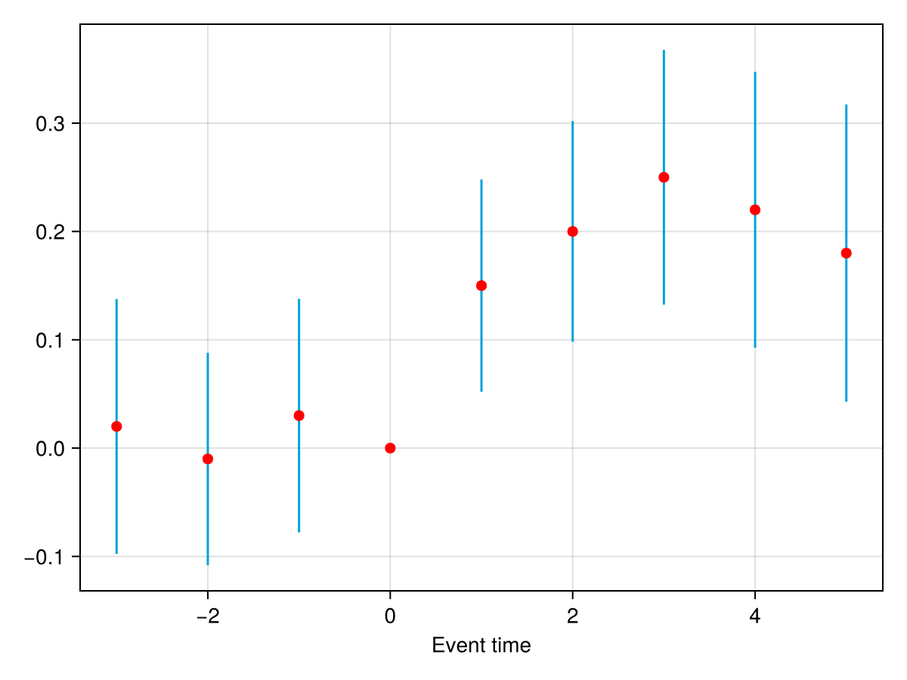
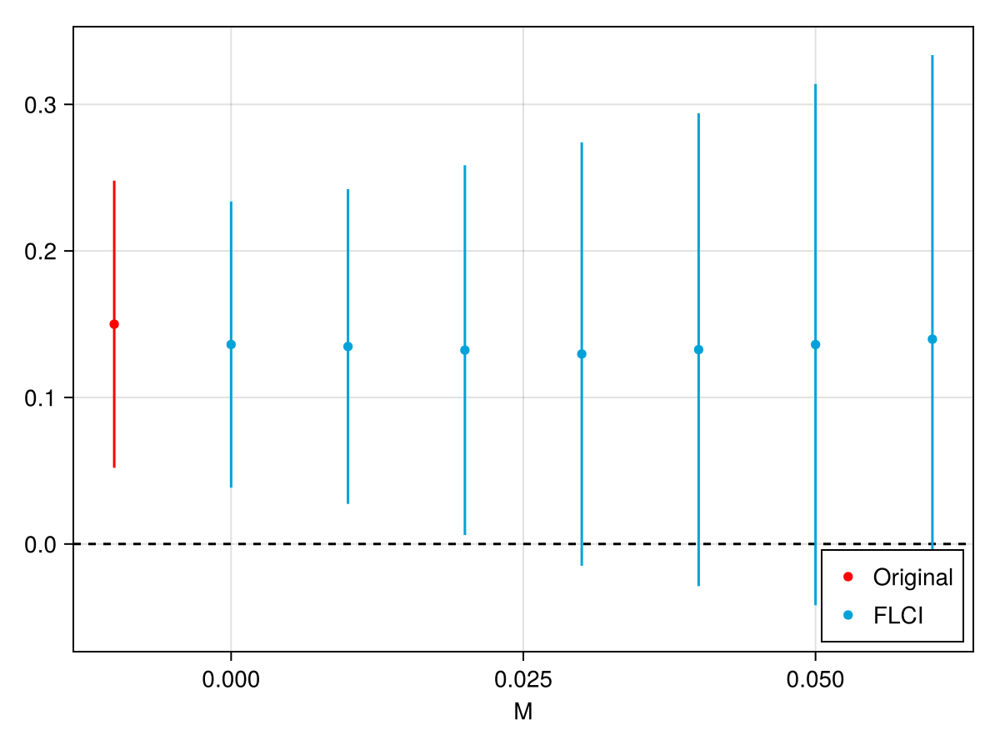
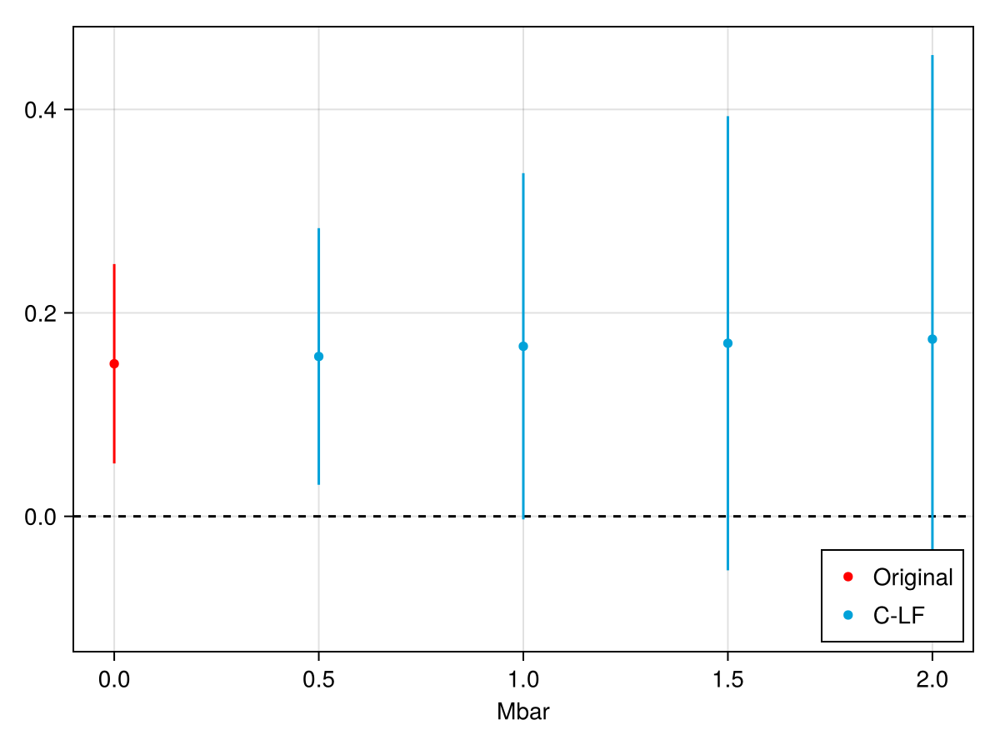

# HonestDiD.jl

[](https://github.com/eohne/HonestDiD.jl/actions/workflows/CI.yml?query=branch%3Amain)
[](https://codecov.io/gh/eohne/HonestDiD.jl)

Julia port of the R package [HonestDiD](https://github.com/asheshrambachan/HonestDiD)
(Rambachan and Roth, 2023). Robust inference and sensitivity analysis for
difference-in-differences and event-study designs.

Standard event-study inference assumes parallel trends holds exactly. This package
instead asks how big a violation of parallel trends would have to be to overturn
your conclusion, and reports confidence intervals that stay valid under a chosen
amount of violation.

- Smoothness restrictions (`Delta^SD`) and relative-magnitude restrictions (`Delta^RM`), plus sign and monotonicity variants
- Conditional, fixed-length (FLCI) and hybrid confidence sets
- Works directly on a `betahat`/`sigma` pair, or on a fitted StatsAPI event-study model (e.g. StagDiDModels.jl)
- Plots through a Plots.jl or Makie.jl extension
- No DataFrames dependency; results are Tables.jl compatible and pretty print

## Installation

```julia
using Pkg
Pkg.add(url = "https://github.com/eohne/HonestDiD.jl")
```

## Background

Rambachan and Roth formalise the idea that pre-trends are informative about
violations of parallel trends. Let `delta` be the vector of differential trends
(the bias in the event-study coefficients). You restrict `delta` to a set `Delta`,
and the package returns confidence sets that are valid for every `delta` in
`Delta`. Two restrictions are central:

Smoothness, `Delta^SD(M)`: the slope of the differential trend can change by no
more than `M` between consecutive periods. `M = 0` means the trend is exactly
linear, larger `M` allows more curvature.

Relative magnitudes, `Delta^RM(Mbar)`: the largest post-treatment violation of
parallel trends is at most `Mbar` times the largest pre-treatment violation.
`Mbar = 1` means "no worse than the worst violation we already see before
treatment".

These can be combined and augmented with sign (bias direction) or monotonicity
(shape) restrictions, which give `Delta^SDB`, `Delta^SDM`, `Delta^RMB`,
`Delta^SDRM` and so on.

## Walkthrough

The functions take a vector of event-study coefficients `betahat` and their
covariance matrix `sigma`, ordered as the pre-periods then the post-periods with
the reference period dropped, plus the counts `numPrePeriods` and
`numPostPeriods`.

Here is a small synthetic event study, 3 pre-periods (roughly zero) and 5
post-periods (a positive effect):

```julia
using HonestDiD

betahat = [0.02, -0.01, 0.03, 0.15, 0.20, 0.25, 0.22, 0.18]   # 3 pre, 5 post
se      = [0.060, 0.050, 0.055, 0.050, 0.052, 0.060, 0.065, 0.070]
rho, n  = 0.6, 8
sigma   = [se[i] * se[j] * rho^abs(i - j) for i in 1:n, j in 1:n]   # AR(1)-ish vcov
numPrePeriods, numPostPeriods = 3, 5
```

Plot the coefficients. Load a backend first (CairoMakie here, `using Plots` works
the same way):

```julia
using CairoMakie

createEventStudyPlot(betahat; sigma = sigma,
                     numPrePeriods = numPrePeriods, numPostPeriods = numPostPeriods,
                     timeVec = [-3, -2, -1, 1, 2, 3, 4, 5], referencePeriod = 0)
```



Pre-periods near zero, a clear positive effect after treatment.

The conventional (non-robust) confidence interval for the first post-period effect:

```julia
julia> constructOriginalCS(betahat, sigma, numPrePeriods, numPostPeriods)
SensitivityResults (1 rows)
  lb         ub      method     Delta
  ───────────────────────────────────
  0.052002   0.248   Original
```

`[0.052, 0.248]`, significant, but only if parallel trends holds exactly.

Now sweep the smoothness bound `M` to see how much non-linearity in the
differential trend it takes to overturn that:

```julia
julia> res_sd = createSensitivityResults(betahat, sigma, numPrePeriods, numPostPeriods;
                                         Mvec = range(0, 0.06, length = 7))
SensitivityResults (7 rows)
  lb          ub        method   Delta     M
  ─────────────────────────────────────────────
  0.03849     0.23376   FLCI     DeltaSD   0
  0.027367    0.2422    FLCI     DeltaSD   0.01
  0.0061132   0.25851   FLCI     DeltaSD   0.02
  -0.01481    0.27416   FLCI     DeltaSD   0.03
  -0.028729   0.294     FLCI     DeltaSD   0.04
  -0.041775   0.31396   FLCI     DeltaSD   0.05
  -0.054089   0.33366   FLCI     DeltaSD   0.06

julia> orig = constructOriginalCS(betahat, sigma, numPrePeriods, numPostPeriods);

julia> createSensitivityPlot(res_sd, orig)
```



The effect stays significant up to about `M = 0.02`. So you can reject a null
effect unless you are willing to let the slope of the differential trend change by
more than ~0.02 between consecutive periods.

Same thing under relative magnitudes:

```julia
julia> res_rm = createSensitivityResults_relativeMagnitudes(
                    betahat, sigma, numPrePeriods, numPostPeriods; Mbarvec = 0.5:0.5:2)
SensitivityResults (4 rows)
  lb          ub        method   Delta     Mbar
  ─────────────────────────────────────────────
  0.031031    0.28328   C-LF     DeltaRM   0.5
  -0.003003   0.33734   C-LF     DeltaRM   1
  -0.053053   0.39339   C-LF     DeltaRM   1.5
  -0.10511    0.45345   C-LF     DeltaRM   2

julia> createSensitivityPlot_relativeMagnitudes(res_rm, orig)
```



The breakdown value is about `Mbar = 1`: the result holds up to post-treatment
violations roughly as large as the worst pre-treatment violation.

### Other target parameters

By default the target is the first post-period effect. Use `l_vec` for any linear
combination `l_vec' * tau_post`, for example the average over the post-periods:

```julia
createSensitivityResults_relativeMagnitudes(betahat, sigma, numPrePeriods, numPostPeriods;
    l_vec = fill(1 / numPostPeriods, numPostPeriods), Mbarvec = 0.5:0.5:2)
```

### Sign and shape restrictions

Add a sign restriction on the bias, or a monotone differential trend, to tighten
the bounds:

```julia
createSensitivityResults(betahat, sigma, numPrePeriods, numPostPeriods;
    Mvec = range(0, 0.06, length = 7), biasDirection = "negative")           # Delta^SDB

createSensitivityResults(betahat, sigma, numPrePeriods, numPostPeriods;
    Mvec = range(0, 0.06, length = 7), monotonicityDirection = "increasing")  # Delta^SDM
```

## StagDiDModels.jl / StatsAPI

Any fitted event-study model that implements the StatsAPI interface with
`τ::<event-time>` coefficient names works directly, in particular the dynamic
estimators in [StagDiDModels.jl](https://github.com/eohne/StagDiDModels.jl):

```julia
using StagDiDModels, HonestDiD, CairoMakie

m = fit_sunab(df; y = :y, id = :id, t = :t, g = :g, cluster = :id)   # dynamic event study

res = honest_did(m; e = 0, type = "relative_magnitude", Mbarvec = 0.5:0.5:2)
createSensitivityPlot_relativeMagnitudes(res.robust_ci, res.orig_ci)
```

`honest_did` mirrors the R `honest_did.AGGTEobj` helper. `type` is `"smoothness"`
(Delta^SD) or `"relative_magnitude"` (Delta^RM), and extra keywords are forwarded
to the underlying `createSensitivityResults`/`createSensitivityResults_relativeMagnitudes`.
The reference period defaults to `-1` (so event time `0` is the first post-period);
pass `ref_p` if yours differs. To pull out the raw inputs instead:

```julia
inp = eventstudy_inputs(m)   # (; betahat, sigma, taus, numPrePeriods, numPostPeriods)
```

## Functions

Every function has a full docstring (`?createSensitivityResults` and so on). The
main ones, with the options you are most likely to set.

### Sensitivity analysis

`createSensitivityResults(betahat, sigma, numPrePeriods, numPostPeriods; ...)`
sweeps the smoothness bound `M` under `Delta^SD` and returns a robust CI for each
value.
 * `Mvec`: the values of `M`. Defaults to a grid from 0 to a data-driven upper bound.
 * `method`: `"FLCI"` (default), `"Conditional"`, `"C-F"` (conditional FLCI) or `"C-LF"` (conditional least-favorable).
 * `monotonicityDirection`: `"increasing"` or `"decreasing"` to also impose a monotone trend (switches to `Delta^SDM`).
 * `biasDirection`: `"positive"` or `"negative"` to also impose a sign restriction (switches to `Delta^SDB`).
 * `l_vec`: the target parameter, default is the first post-period effect.
 * `alpha`: `1 - alpha` is the coverage, default `0.05`.

`createSensitivityResults_relativeMagnitudes(betahat, sigma, numPrePeriods, numPostPeriods; ...)`
does the same under relative magnitudes (`Delta^RM`), sweeping `Mbar`.
 * `Mbarvec`: the values of `Mbar`, default is 10 points on `[0, 2]`.
 * `bound`: `"deviation from parallel trends"` (default, `Delta^RM`) or `"deviation from linear trend"` (`Delta^SDRM`, needs at least 2 pre-periods).
 * `method`: `"C-LF"` (default) or `"Conditional"`.
 * `monotonicityDirection` / `biasDirection`: add a shape or sign restriction (not both).
 * `l_vec`, `alpha`, `gridPoints`.

`constructOriginalCS(betahat, sigma, numPrePeriods, numPostPeriods; l_vec, alpha)`
is the conventional normal CI that assumes parallel trends holds exactly. Use it as
the baseline and as the `originalResults` argument to the plots.

### One restriction at a time

`findOptimalFLCI(betahat, sigma, M, numPrePeriods, numPostPeriods; l_vec, alpha)`
returns the optimal fixed-length CI under `Delta^SD(M)`: the interval, the affine
weights on `betahat`, and the half-length.

`computeConditionalCS_DeltaSD(betahat, sigma, numPrePeriods, numPostPeriods; ...)`
and the variants below each return a `ConditionalCS` (the test-inversion grid).
They share these options:
 * `M` (or `Mbar` for the RM family): the restriction bound.
 * `hybrid_flag`: `"FLCI"`, `"LF"` or `"ARP"` for the SD family; `"LF"` (default) or `"ARP"` for the RM family.
 * `l_vec`, `alpha`, `hybrid_kappa`, `gridPoints`, `grid_lb`, `grid_ub`, `postPeriodMomentsOnly`, `returnLength`, `seed`.

The variants, and the extra option each one takes:
 * `...DeltaSD`: smoothness
 * `...DeltaSDB`: smoothness + sign (`biasDirection`)
 * `...DeltaSDM`: smoothness + monotonicity (`monotonicityDirection`)
 * `...DeltaRM`: relative magnitudes
 * `...DeltaRMB` / `...DeltaRMM`: relative magnitudes + sign / monotonicity
 * `...DeltaSDRM`: relative magnitudes of the non-linear (second-difference) component, needs at least 2 pre-periods
 * `...DeltaSDRMB` / `...DeltaSDRMM`: that + sign / monotonicity

### Bounds, integration, plots

`DeltaSD_upperBound_Mpre` / `DeltaSD_lowerBound_Mpre(betahat, sigma, numPrePeriods; alpha)`
give data-driven bounds on `M` from the pre-period coefficients. The upper bound is
what `createSensitivityResults` uses to pick its default `Mvec`.

`eventstudy_inputs(model; ref_p = -1)` pulls `(betahat, sigma, taus, numPrePeriods,
numPostPeriods)` out of a fitted StatsAPI event-study model.

`honest_did(model; e = 0, type, ...)` runs the whole analysis for event time `e`
straight off a fitted model. `type` is `"smoothness"` or `"relative_magnitude"`,
and extra keywords pass through to the `createSensitivityResults*` underneath.

`createSensitivityPlot(robust, original; rescaleFactor, maxM, add_xAxis)`,
`createSensitivityPlot_relativeMagnitudes(robust, original; rescaleFactor, maxMbar, add_xAxis)`
and `createEventStudyPlot(betahat; sigma or stdErrors, numPrePeriods, numPostPeriods, timeVec, referencePeriod, alpha)`
need a Plots or Makie backend loaded.

`basisVector(i, n)` builds a unit vector for `l_vec`. `confidence_interval(cs)`
returns the `(lb, ub)` of a `ConditionalCS`.

`createSensitivityResults*` and `constructOriginalCS` return a `SensitivityResults`
table; `computeConditionalCS_*` returns a `ConditionalCS` (`grid`, `accept`), and
`confidence_interval(cs)` gives its `(lb, ub)`. Both pretty print and implement the
[Tables.jl](https://github.com/JuliaData/Tables.jl) interface, so they convert to a
DataFrame or write to CSV without HonestDiD depending on either:

```julia
using DataFrames
DataFrame(res_sd)
using CSV; CSV.write("sensitivity.csv", res_sd)
```

## Solvers

Linear programs use [HiGHS](https://github.com/jump-dev/HiGHS.jl), the conic (FLCI
bias) programs use [ECOS](https://github.com/jump-dev/ECOS.jl) (the solver the R
package uses through CVXR), both through [JuMP](https://jump.dev). The test
inversion reuses one warm-started LP across the grid (only the right-hand side
changes with the candidate value), so it runs a good bit faster than the R
package: `computeConditionalCS_DeltaSD` takes about 0.05s on the example above
versus about 0.8s in R.

## Differences from the R package

Validated against the R package on its bundled `BCdata_EventStudy`: LP solutions
and duals, FLCI, the ARP conditional grids and the sensitivity tables all match to
numerical precision. Two places differ on purpose, and they are different kinds of
thing:

A precision choice, not a bug fix. R's `.qfoldednormal` (the folded-normal
quantile in the FLCI half-length) is a Monte-Carlo estimate, `quantile(abs(rnorm(1e6) + mu), p)`.
We compute the same quantity (the quantile of `|N(mu, sd)|`) analytically by
inverting the folded-normal CDF, which is exact and deterministic rather than
carrying ~1e-3 simulation error and a hidden seed dependence. FLCI half-lengths
therefore differ from R by less than about 1e-3.

A genuine bug fix. `create_A_M` with `numPrePeriods == 1` runs into R's
`1:0 == c(1,0)` gotcha and writes a stray `A_M[1,2] = -1`, which quietly weakens
the monotonicity restriction (it replaces `delta_pre <= 0` with
`delta_pre <= delta_post1`). That path is reachable and unguarded in R, so we emit
the intended constraint instead. For `numPrePeriods >= 2` the matrices are
identical to R.

The least-favorable hybrid critical value is simulated, so with a different RNG it
matches R only approximately.

## Acknowledgements

Port by Elias Ohneberg. Original R package and methods by
[Ashesh Rambachan](https://asheshrambachan.github.io/) and
[Jonathan Roth](https://www.jonathandroth.com/).

Rambachan, A. and Roth, J. (2023). A More Credible Approach to Parallel Trends.
Review of Economic Studies 90(5): 2555-2591. https://doi.org/10.1093/restud/rdad018
